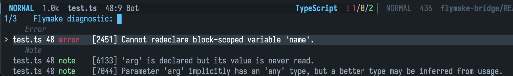

# flymake-bridge

A [lsp-bridge](https://github.com/manateelazycat/lsp-bridge) Flymake backend for server diagnostics.

## Screenshot

for example, a Typescript server diagnostics:


## Usage

Enable it by calling `flymake-bridge-setup' from a file-visiting buffer. Or add it to hooks such as:

```elisp
(require 'flymake-bridge)
(add-hook 'lsp-bridge-mode-hook #'flymake-bridge-setup)
```
